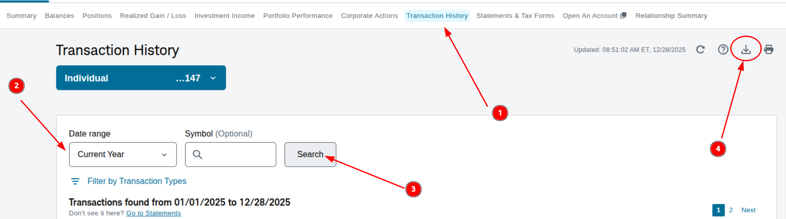
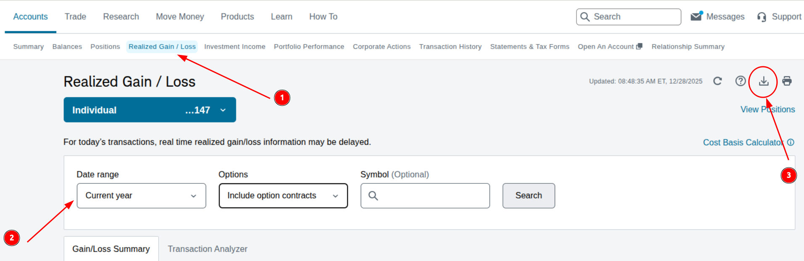
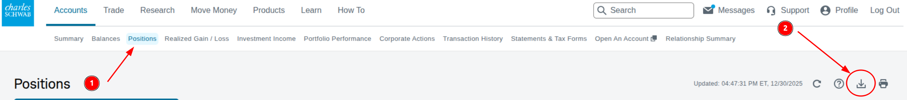

# Herramienta para preparar la renta (España) para inversiones en bolsa (Schwab)

CLI en Python para automatizar parte del trabajo “manual” de la fiscalidad de un inversor español con bróker extranjero (Charles Schwab):
- **IRPF (Renta)**: dividendos + plusvalías/minusvalías realizadas en acciones.
- **Modelo 720 (MVP)**: borrador de valoración en EUR para valores/acciones a 31/12 (en progreso).

Proyecto pensado para ser **reproducible**, **auditable** y cómodo de ejecutar con `uv`, con salidas en CSV listas para copiar/contrastar con Renta WEB y para dejar trazabilidad en tu portfolio.

## Finalidad de este repo

Cuando operas con acciones en un bróker extranjero:
- Los informes suelen venir en **USD**.
- Necesitas consolidar **dividendos**, **retenciones/impuestos en origen** y **ganancias/pérdidas realizadas**.
- Para reportar en España, necesitas convertir a **EUR** con un criterio consistente y trazable (aquí: tipo de cambio de referencia del BCE y “último día hábil anterior” si no hay fixing).

Este repo convierte exports de Schwab y genera reportes consistentes en EUR, listos para revisión.

## Instalación

```bash
uv sync
```

## Uso

Ejecuta el CLI sin entorno:
```bash
uv run dec-renta --help
```

Coloca tus ficheros en data/, por ejemplo:

- `Individual_XXX147_Transactions_20251227-143642.csv`
- `XXXX3147_GainLoss_Realized_Details_20251227-093447.csv`

Ejecuta:
```bash
uv run dec-renta renta-bolsa run --data-dir data --out-dir out
```

Opciones Utiles:
```bash
uv run dec-renta renta-bolsa run --refresh-fx
uv run dec-renta renta-bolsa run --year 2025
```

## Tecnologías

- **Python 3.10+**: base del proyecto.
- **Typer**: CLI moderno con type hints, ayudas automáticas y subcomandos.
- **Pandas**: parsing y agregaciones (totales anuales, group by por símbolo, outputs CSV).
- **Requests**: llamadas HTTP a la API del **Banco Central Europeo** (ECB Data Portal).
- **Hatchling**: backend de build (PEP 517) para empaquetar.
- **uv**: gestor de entorno y dependencias (rápido, reproducible).

## Modelo 100

### Lógica fiscal (la que implementa la herramienta)

Criterio de fechas:

- Dividendos: tipo de cambio por Date de la transacción.
- Ventas (realized): tipo de cambio por Closed Date.

Si no hay fixing ese día (finde/festivo): usar el último disponible anterior (forward-fill al construir el calendario diario).

BCE publica “USD por 1 EUR” por lo que $EUR = \dfrac{USD}{USD_{eur}}$

[Source](https://www.ecb.europa.eu/stats/policy_and_exchange_rates/euro_reference_exchange_rates/html/index.en.html)

## Input

Hay que extraer los CSV de Schwab de la siguiente manera.

- Dividendos:

<div align="center">



</div>

- Plusvalias (Compra/venta de acciones):

<div align="center">



</div>

Dejamos los ficheros de entrada en la carpeta data/.

- `data/Indiviual_XXX*\_Transactions_2025*.csv` (Dividendos)
- `data/XXX*\_GainLoss_Realized_Details2025*.csv` (Ventas)

## Outpout

Salida (por defecto):

- `out/resumen_anual_2025.csv`
- `out/desglose_symbol_2025.csv`


## Modelo 720

## Input

A fecha 31 de diciembre del año en cuestión,
Hay que extraer un único CSV de Schwab de la siguiente manera.

<div align="center">



</div>

Dejamos el fichero de entrada en la carpeta data/.

- `data/Individual-Positions-2025-12-31-*.csv`

## Outpout

Salida (por defecto):

- `out/modelo_720_2025.csv`

## Disclaimer

Esto **no es asesoramiento fiscal**. Es una herramienta técnica de consolidación y cálculo para facilitar la preparación de la declaración, pero la revisión final corresponde al contribuyente.